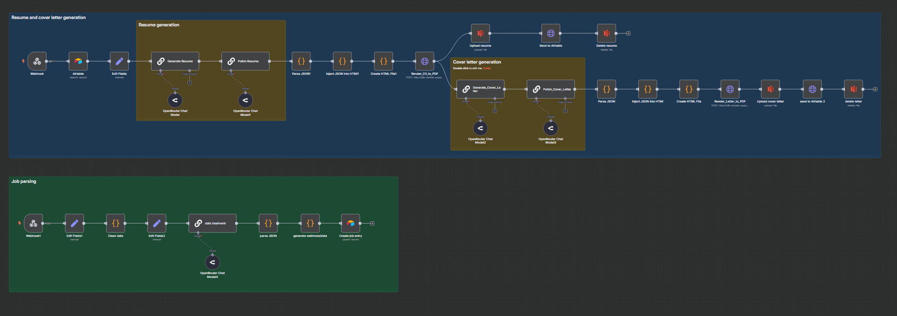
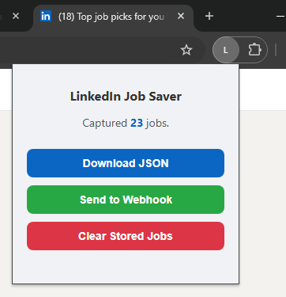
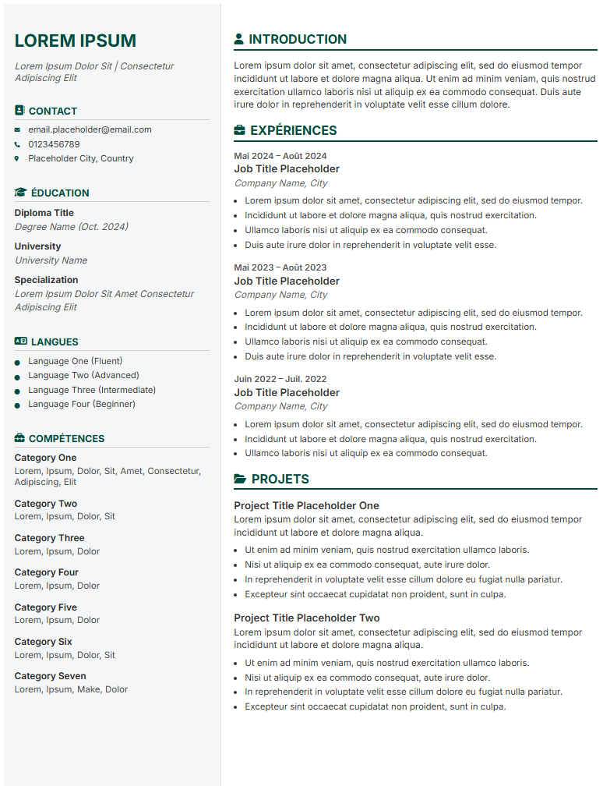
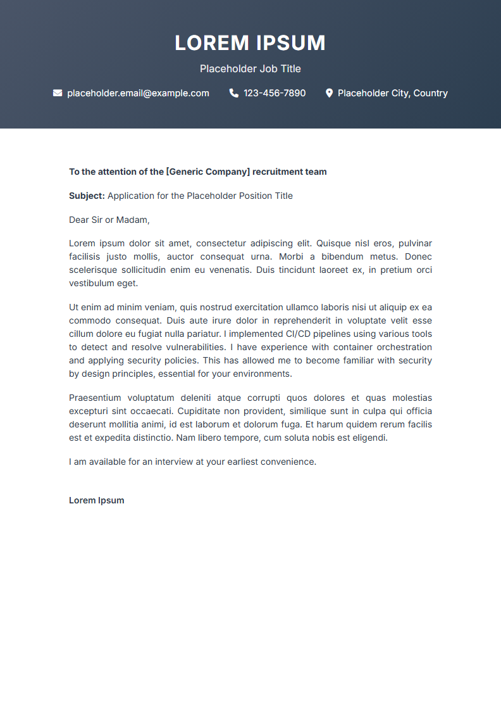

# Save & Tailor
*One-click job capture and instant, tailored résumé & cover-letter generation*

---

## Table of Contents
1.  [Overview](#overview)
2.  [Architecture at a Glance](#architecture-at-a-glance)
3.  [Component Deep Dives](#component-deep-dives)
    1.  [Chrome Extension](#chrome-extension)
    2.  [n8n “Job Parser” Workflow](#n8n-job-parser-workflow)
    3.  [Airtable Base Schema](#airtable-base-schema)
    4.  [n8n “Document Generator” Workflow](#n8n-document-generator-workflow)
    5.  [Templates & Prompts](#templates--prompts)
4.  [Key Achievements](#key-achievements)
5.  [Future Roadmap & Potential Improvements](#future-roadmap--potential-improvements)

---

## Overview
Job seekers waste hours copy-pasting and manually tailoring applications. **Save & Tailor** solves this by:
-   Intelligently capturing the details of each job you click on and read on LinkedIn.
-   Parsing & storing key fields in Airtable.
-   Generating fully-tailored résumé and cover-letter PDFs on demand.
-   Uploading the finished documents back into Airtable for one-click download.

This system acts as a powerful, automated assistant, transforming the tedious task of job application into a streamlined, efficient process.

---

## Architecture at a Glance
The system is composed of a custom Chrome Extension that captures data, an Airtable base that stores it, and two n8n workflows that orchestrate the parsing and document generation.


*Data flows from the Chrome extension → n8n Job Parser → Airtable → n8n Document Generator → Airtable (PDF attachments).*

---

## Component Deep Dives

### Chrome Extension


-   **Purpose**
    As a user browses jobs on LinkedIn, the custom-built extension automatically detects and scrapes the full text content and URL of each listing they view. This data is stored locally in the browser until it's ready to be processed.

-   **How It Works**
    A content script (`content.js`) injects itself into LinkedIn job pages and uses a `MutationObserver` to watch for when the job details pane is loaded or updated. It then extracts the canonical job URL and the entire visible text of the job description, sending this data to a background script. The background script (`background.js`) checks for duplicates and saves new jobs to the browser's local storage.

-   **Stored Data**
    The extension captures a simple JSON object for each job, containing the URL and the raw text content. The parsing into more detailed fields happens later in the n8n workflow.

    ```json
    [
      {
        "url": "[https://www.linkedin.com/jobs/view/123456789/](https://www.linkedin.com/jobs/view/123456789/)",
        "text": "Company Name\nJob Title\nLocation\nPosted X days ago...\n\nAbout the job\nFull job description text..."
      }
    ]
    ```

-   **Popup Controls**
    The extension's popup provides full control over the locally captured jobs:
    -   **Live Job Count**: Displays a live count of jobs currently stored in the browser.
    -   **Download JSON**: An option to export the complete array of captured jobs into a timestamped `.json` file for backup or manual use.
    -   **Send to Webhook**: A button to send the entire job array via a `POST` request to a configured n8n webhook for parsing and storage.
    -   **Clear Stored Jobs**: A function to wipe all jobs from the extension's local storage after a confirmation prompt. An options page also allows for easy configuration of the target webhook URL.

### n8n “Job Parser” Workflow
This workflow is the bridge between the browser and the Airtable database.

-   **Trigger**: An HTTP webhook listens for the JSON array sent from the Chrome Extension.
-   **Split**: The workflow first splits the incoming array of jobs to process them one by one.
-   **Parse & Enrich**: An LLM node receives the raw `text` field for each job. It parses out structured data such as `jobTitle`, `company`, `location`, and cleans up the job `description`.
-   **Upsert Record**: An Airtable node takes the structured data and creates a new record, using the unique LinkedIn Job ID as a key to prevent duplicates.

### Airtable Base Schema
Airtable acts as the central database and dashboard for the job applications.

| Field | Type | Description |
| :--- | :--- | :--- |
| `jobId` | Single line text | The unique LinkedIn job identifier (extracted from the URL). |
| `jobTitle` | Single line text | The parsed job title. |
| `company` | Single line text | The parsed company name. |
| `url` | URL | The direct link to the LinkedIn job posting. |
| `status` | Single select | Tracks the current state: `[Saved, Parsed, Generating, Done, Error]` |
| `generate` | Button | Triggers the "Document Generator" n8n workflow for this specific job. |
| `description` | Long text | The cleaned, full-text job description from the LLM. |
| `Resume PDF` | Attachment | The final, tailored résumé PDF is uploaded here. |
| `Cover Letter PDF` | Attachment | The final, tailored cover letter PDF is uploaded here. |
| `master_cv_json` | Long text | (In a separate "Profile" table) The user's master résumé in JSON format. |

### n8n “Document Generator” Workflow
This workflow triggers on-demand to create the application materials.

1.  **Trigger**: Receives a webhook from Airtable, initiated by the **`generate`** button. The webhook payload contains the data for that specific job record.
2.  **Fetch Data**: A second Airtable node fetches the user's "master résumé" JSON from a central profile table.
3.  **LLM Magic**: The core of the workflow uses two parallel branches to generate content:
    -   **Résumé**: An LLM prompt is fed the master résumé JSON and the specific job description. It returns a new, tailored JSON object with the most relevant skills and experiences highlighted.
    -   **Cover Letter**: A separate LLM prompt is fed personal details and the job description, generating a compelling, tailored cover letter.
4.  **Render PDFs**: The generated JSON and text are injected into pre-made HTML templates. A Puppeteer node renders these populated HTML files into polished PDFs.
5.  **Upload & Update**: The generated PDF files are uploaded back to the corresponding `Resume PDF` and `Cover Letter` attachment fields in the Airtable record, and the `status` is set to "Done".

### Templates & Prompts
The quality of the final documents depends on high-quality templates and well-crafted prompts.

-   **HTML Templates**: The project utilizes two semantic HTML templates. They are styled with CSS and use simple placeholders like `{{name}}`, `{{jobTitle}}`, and `{{bullet_points}}` that are replaced with the LLM-generated content.

    
    

-   **Prompts**: The prompts are engineered to be highly specific, providing the LLM with clear instructions, structured data inputs, and the desired output format (e.g., a specific JSON schema for the résumé).
    > **Example Prompt Snippet:**
    > *"Given the master résumé JSON and this job description, generate a tailored résumé JSON emphasizing relevant skills and achievements.”*

---

## Key Achievements
-   **End-to-End Automation**: We successfully designed and implemented a fully automated pipeline, from capturing job data on a dynamic website to generating and storing tailored application documents.
-   **Robust Scraping**: The extension reliably captures data from LinkedIn's complex, single-page application structure by using a `MutationObserver`, ensuring data is only scraped when fully loaded.
-   **Modular & Decoupled Architecture**: The system is built with independent components (extension, parser, generator) that communicate via webhooks. This makes the system resilient, scalable, and easy to maintain.
-   **On-Demand Personalization**: The project successfully leverages Large Language Models to transform a generic master résumé into a highly specific, tailored document for each unique job application, all initiated by a single button click.
-   **Seamless User Experience**: The capture process is passive and requires no user interaction, while the popup provides simple, intuitive controls for managing the captured data.

---

## Future Roadmap & Potential Improvements
-   **Multi-Platform Support**: Expand the scraper's capability beyond LinkedIn to other major job boards like Indeed, Glassdoor, and specific company career portals. This would involve creating new, platform-specific parsing logic within the content script.
-   **Expanded Template Library**:
    -   Introduce multiple visual templates for résumés (e.g., "Modern," "Classic," "Technical") and cover letters that users can choose from before generation.
    -   Add new document types, such as templates for "Thank You" notes or interview follow-up emails.
-   **Advanced AI Features**:
    -   **Keyword Analysis & Match Score**: Before generating documents, an LLM could analyze the job description against the master résumé and provide a "match score" or suggest specific skills and keywords to include.
    -   **Interactive Editing**: Allow the user to review and edit the LLM-generated content in a simple web interface before the final PDF is rendered.
-   **Deeper ATS Functionality**: Evolve the Airtable base into a more comprehensive Applicant Tracking System (ATS), with fields and views for tracking interview stages, recruiter contacts, follow-up dates, and personal notes for each application.
-   **Enhanced Error Handling**: Implement a more robust notification system within the n8n workflows to alert the user (e.g., via email or a failed status in Airtable) if a step like LLM parsing or PDF generation fails.
